# The Very First Projects

The very first VB6 projects written by MaxXing, completed in 2010.

初学 VB6 的时候编写的各类程序, 完成于 2010 年 8 月到 11 月 (大概小学/初一).

其实严格意义上讲我并不是从 VB6 入门编程的, 在此之前:

* 五年级的时候我接触过 Scratch, 并用五年级的英语水平加雅虎翻译在 Scratch 论坛上疯狂寻找把 Scratch 程序打包成 exe 的方法.
* 小学毕业放暑假, 在接触 VB6 之前的一个月我还接触了 VBScript. 至于为什么会接触这个东西, 这个就说来话长了. 当时电视上有个先锋纪录频道, 这个频道右上角会出现 VBS (Vanguard Broadcasting System) 的标志, 然后我就去百度搜索 VBS, 然后搜到了 VBScript 的百度百科. 百度百科里居然有个 VBS 的入门教程这是我没想到的 (看了一眼现在[还有](https://baike.baidu.com/item/VBS/1700748)).

然后就了解到 VBS 和 VB 的相关性, 在电脑上装了个 VB6, 从此开始了罪恶的程序猿的一生.

刚入门 VB 的时候写的程序基本都很没用, 不过有的还挺有趣的. 这段时间基本就在摸索 VB 里到底都有什么控件, 每个控件都有什么玩法. 有的时候在程序里画出个工具栏, 画出个进度条, 写几句相关的代码, 都能高兴一下午.

还是那个时候好, 我对和计算机相关的一切事物都充满了好奇.

当然, 现在对未知的东西依然充满了好奇, 希望再接再厉.

## 项目列表 (时间顺序)

### 无聊程序 - 2010.8.23

接触 VBS 的时候最喜欢干的事情就是写整人程序, 最经典的整人程序莫过于死循环弹对话框, 这个程序发扬了这个优良传统.

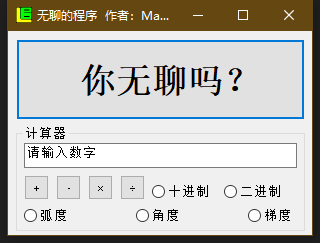

### 计算器 - 2010.8.23

一个功能正常的计算器程序, 但健壮性很差, 很多地方都没有做容错处理, 例如你对两段文字做乘法时, 程序会崩溃.

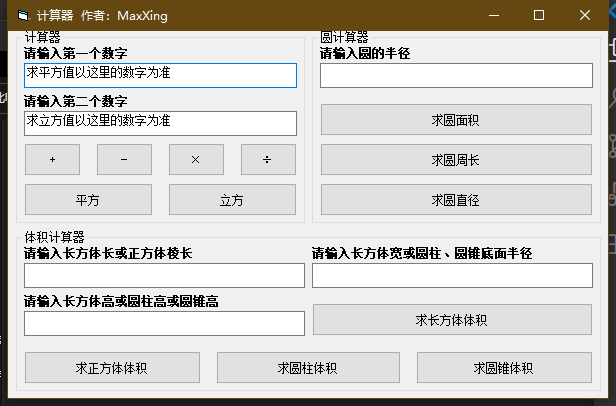

### VBS 脚本编辑器 - 2010.8.25

写 VBS 可以说是老本行了, 于是就用 VB6 写了个 "编辑器". 但这根本就没法算作编辑器, 功能太简陋了. 甚至保存文件都只能保存在固定的位置, 而且会做很多迷之操作, 比如一个文件保存一次删掉然后再保存一次. 因为我当时根本就没整明白保存文件到底要怎么写, 代码都是从搜索引擎里搜索然后拼凑出来的.

不过, 现在看来很多人依然无法掌握从搜索引擎获取自己想要的代码并拼凑出一个能跑的程序的能力, 我遇到这种人会很自然的~~鄙视~~他们, 因为他们甚至还不如一个小学生.

我还记得写完这个程序的那个下午, 我跑到厨房和正在做饭的妈妈说, 自己终于会编程了.

那个时候我一定相当快乐吧.

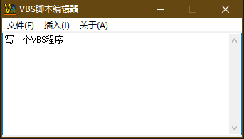

### 快捷搜索 - 2010.8.27

一个可以从百度, 谷歌和搜狗三个搜索引擎上搜索关键词的程序, 带一个 IE Frame 用来展示搜索结果.

为了炫耀自己的编程能力, 我把同学叫到家里, 然后三下五除二 (真的吗?) 写出了这样的程序.

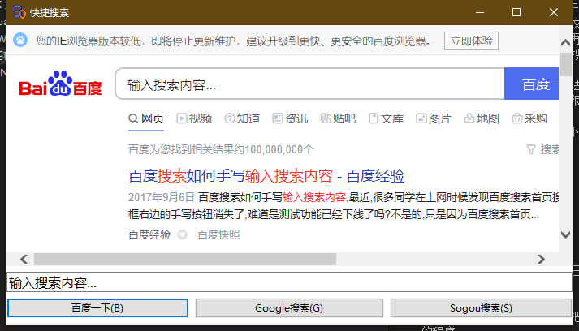

### Windows 快捷程序 - 2010.9.7

一个可以执行一些 Windows 相关的操作, 例如关机, 重启, 或者打开命令提示符之类的程序.

图标是从 Windows Vista 里偷得.

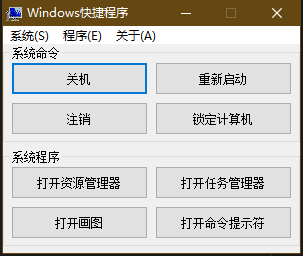

### 猜数字程序 - 2010.9.7

第一个, 呃, 游戏. 这种无聊的玩意耶能算游戏吗? 我当时写出这个程序都觉得自己真实太无聊了.

不过相比之前的程序还是复杂了很多, 因为多了很多逻辑判断之类的代码.

界面上的东西都是用画图做的 (熟练掌握用 Windows 画图画渐变色的方法), 论如何把你的设计师朋友气到脑中风.

初中开学了, 继续向同班的同学们好好炫耀了一番.

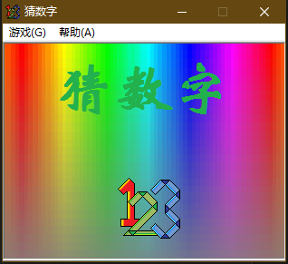

### 图画板 - 2010.9.11

一个画画用的程序, 还可以保存画完的画.

从爷爷的书架上找到了讲 VB6 的很老的书, 于是这个时候终于知道怎么保存文件了.

程序变得复杂了起来.

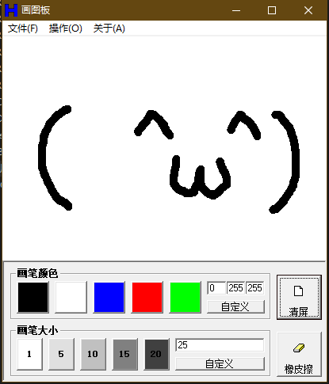

### 文本编辑器 - 2010.9.22

一个能编辑纯文本和富文本的文本编辑器. 当然, 听起来很复杂, 其实基本都是套控件.

当时非常喜欢写各种编辑器之类的, 因为感觉工具栏, 状态栏, 菜单, 富文本框之类的控件都很厉害.

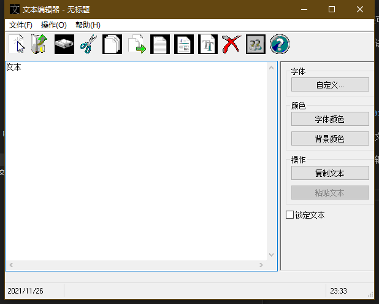

### game xigua - 2010.11.7

又是一个游戏程序, 程序会倒计时 10 秒, 然后你需要在 10 秒内尽可能多的按下 C 键. 每按一次 C 键, 屏幕上的手就会戳一下西瓜, 直到你把西瓜戳爆, 戳西瓜的时候还有音效.

至少比猜数字有趣多了.

之前玩到过规则完全一样的 Flash 小游戏, 于是用 VB6 复刻了一下.

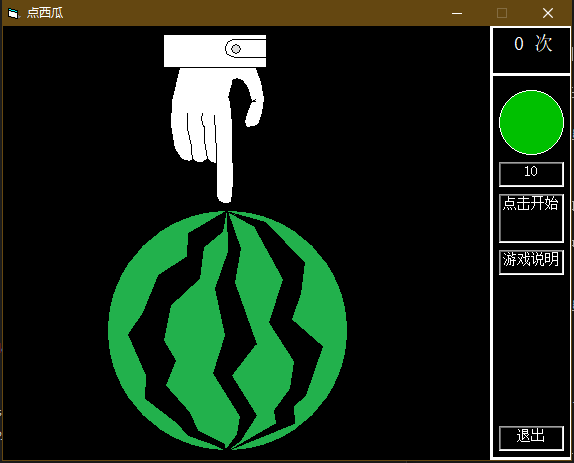

### 便签 - 2010.11.16

一个桌面便签小程序, 看起来和 Vista 的便签小工具长得差不多 (因为界面直接就是用这个小工具的截图改的).

这个程序的界面是不规则且半透明的, 因为调用了 Windows 的 API. 我这个时候似乎已经开始研究各种稀奇古怪的 Windows API 了.

这个程序的优势是, 勾选 "随意模式" 之后, 你可以在便签上画画.

这也算优势吗?

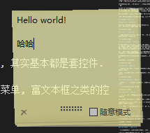

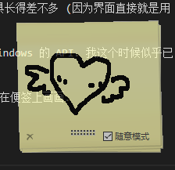

## Copyright and License

Copyright (C) 2010 MaxXSoft (MaxXing). License GPLv3.
